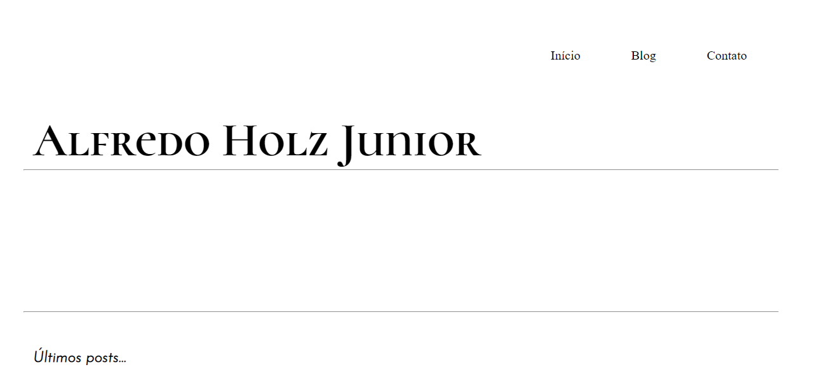

# nextmyportfolio

Um simples blog feito com nextjs.



<hr>


para começar:
```command
yarn
```

para rodar em modo de desenvolvimento:
```command
yarn dev
```

mais informações no meu [Blog](https://www.alfredohjr.com.br)